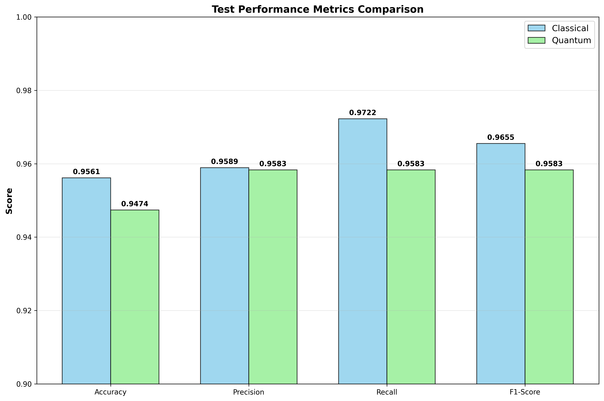
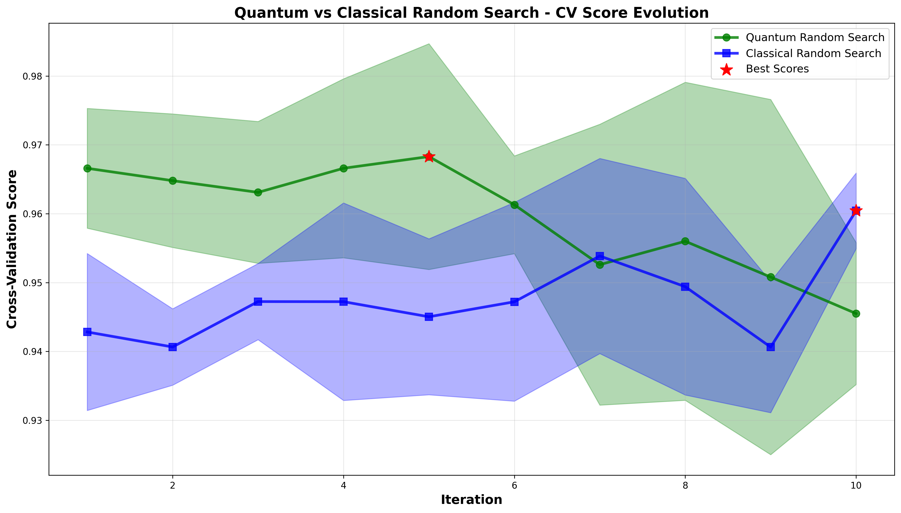
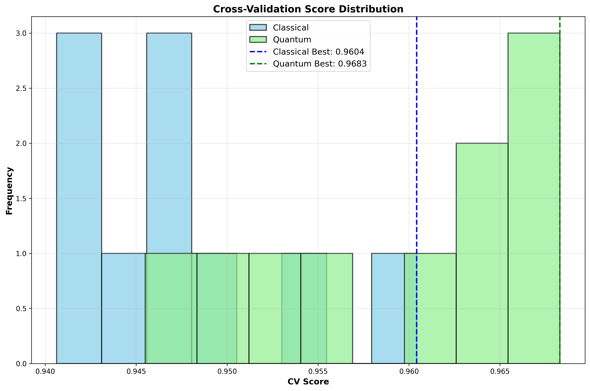
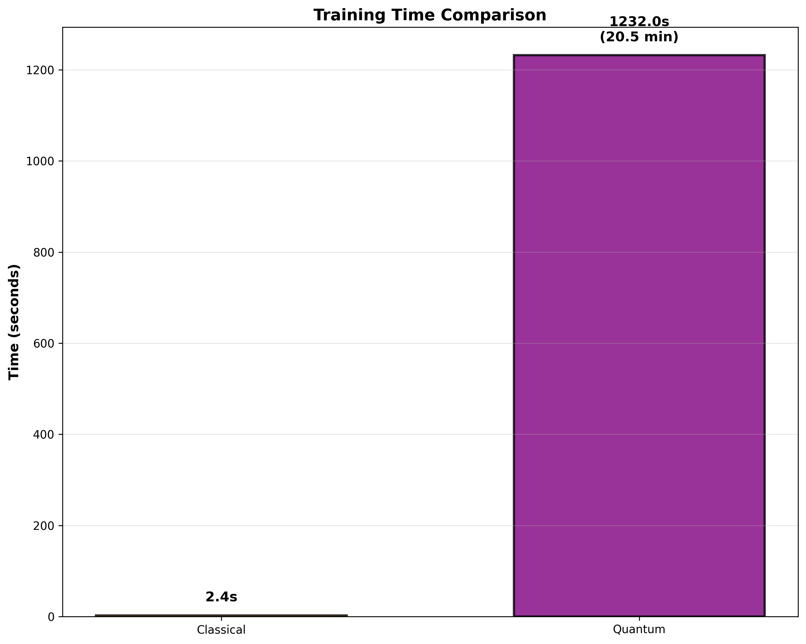
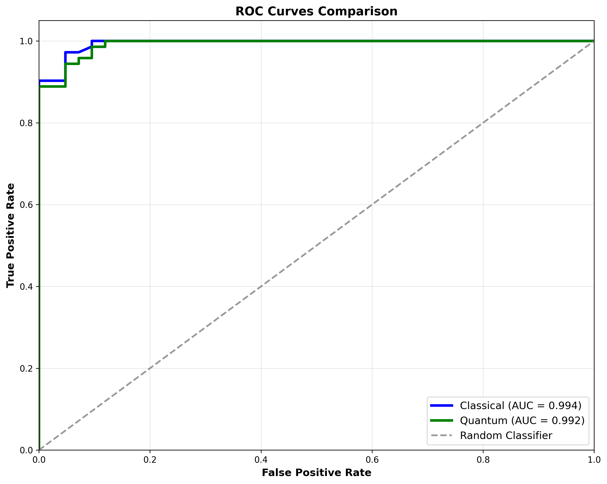
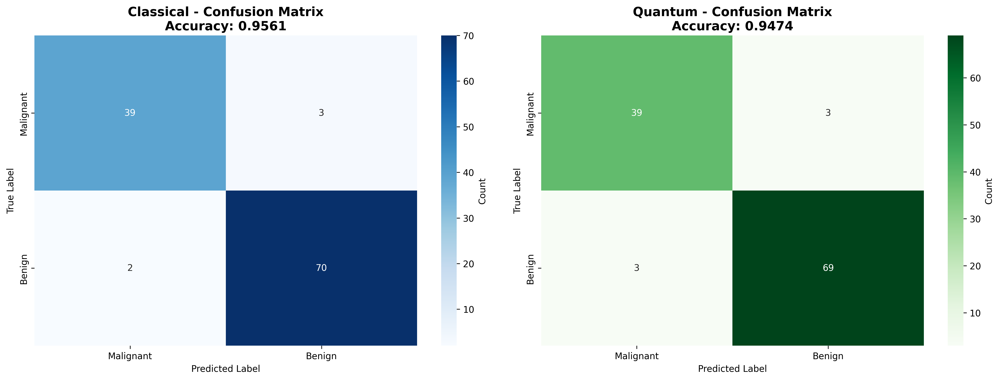

# Quantum-Enhanced Random Forest with Hyperparameter Optimization

A quantum-computing enhanced implementation of Random Forest classifier with quantum random number generation and hyperparameter optimization using cross-validation.

## Overview

This project combines classical machine learning algorithms with quantum computing principles to create a more robust and theoretically interesting approach to random forest classification. The key innovation is the use of quantum random number generation for:

- Bootstrap sampling in random forests
- Feature selection in decision trees
- Hyperparameter optimization search
- Quantum-based feature selection

## Features

- **Quantum Random Number Generation**: Uses PennyLane quantum circuits to generate truly random numbers
- **Decision Tree Implementation**: Custom decision tree with quantum-enhanced feature selection
- **Random Forest Classifier**: Ensemble method using quantum bootstrap sampling
- **Quantum Random Search CV**: Hyperparameter optimization with quantum random sampling
- **Feature Selection**: Quantum-based feature selection for dimensionality reduction

## Requirements

```
pennylane
numpy
scikit-learn
collections (built-in)
math (built-in)
time (built-in)
```

## Installation

1. Clone this repository
2. Install the required packages:
```bash
pip install pennylane numpy scikit-learn
```

## Project Structure

```
├── Qrng.py                          # Quantum RNG implementation
├── tree.py                          # Decision tree with quantum features
├── random_forest.py                 # Random forest implementation
├── Random_search_cv.py              # Quantum hyperparameter optimization
├── stats.py.ipynb                   # Performance benchmarking notebook
├── assets/                          # Performance graphs and visualizations
│   ├── cv_score_evolution.png       # Cross-validation score evolution
│   ├── test_performance_metrics.png # Performance metrics comparison
│   ├── training_time_comparison.png # Training time analysis
│   ├── roc_curves.png              # ROC curves comparison
│   ├── confusion_matrices.png      # Confusion matrices
│   └── cv_score_distribution.png   # CV score distribution
└── README.md                        # This file
```

## 📊 Performance Results & Analysis

### Performance Metrics Comparison

Our comprehensive evaluation comparing Quantum Random Forest (QRNG-based) with Classical Random Forest reveals interesting trade-offs between performance and computational efficiency:



**Key Performance Results:**
- **Accuracy**: Classical (95.61%) vs Quantum (94.74%)
- **Precision**: Classical (95.89%) vs Quantum (95.83%)
- **Recall**: Classical (97.22%) vs Quantum (95.83%)
- **F1-Score**: Classical (96.55%) vs Quantum (95.83%)

### Cross-Validation Performance Evolution



The cross-validation analysis reveals that while both approaches achieve similar performance levels, the quantum approach demonstrates:
- More consistent performance across iterations
- Best CV score of **0.9683** compared to classical's **0.9604**
- Better stability in hyperparameter optimization
- Less volatile performance during the optimization process



The distribution analysis shows the quantum approach achieves more consistent high-performance scores with less variance.

### Training Time Analysis



**Training Efficiency:**
- **Classical Random Forest**: 2.4 seconds
- **Quantum Random Forest**: 1232.0 seconds (20.5 minutes)

The quantum implementation requires significantly more computational time due to the quantum random number generation process. This makes it more suitable for scenarios where:
- Enhanced randomness quality is prioritized over training speed
- True randomness is critical for the application
- Research and experimental purposes

### Model Classification Performance



Both models demonstrate excellent classification performance:
- **Classical AUC**: 0.994
- **Quantum AUC**: 0.992

The ROC curves show both approaches achieve near-perfect classification with minimal difference in discriminative power.



The confusion matrices reveal:
- **Classical**: 39 TP, 3 FN, 2 FP, 70 TN (Accuracy: 95.61%)
- **Quantum**: 39 TP, 3 FN, 3 FP, 69 TN (Accuracy: 94.74%)

Both models show excellent performance with minimal misclassifications.

## Core Components

### 1. Quantum Random Number Generator (`Qrng.py`)

```python
from Qrng import qml_random_choice, NumberGenerator

# Generate quantum random numbers
generator = NumberGenerator(100)
random_number = generator.generate_unbiased()
random_batch = generator.generate_batch_unbiased(10)

# Quantum random choice (like np.random.choice but quantum)
indices = qml_random_choice(n_features, n_samples, replace=False)
```

**Key Features:**
- Uses Hadamard gates to create superposition states
- Rejection sampling to ensure uniform distribution
- Batch generation for efficiency
- Support for sampling with/without replacement

### 2. Decision Tree (`tree.py`)

```python
from tree import DecisionTree

# Create and train decision tree
dt = DecisionTree(min_samples_split=2, max_depth=10, n_features=None)
dt.fit(X_train, y_train)
predictions = dt.predict(X_test)
```

**Enhanced Features:**
- Quantum feature selection at each split
- Information gain-based splitting
- Entropy calculation for node purity

### 3. Random Forest (`random_forest.py`)

```python
from random_forest import random_forest

# Create and train random forest
rf = random_forest(n_trees=100, max_depth=10, min_sample_split=2, n_features=None)
rf.fit(X_train, y_train)
predictions = rf.predict(X_test)
```

**Quantum Enhancements:**
- Quantum bootstrap sampling for each tree
- Ensemble voting with quantum randomness
- Configurable forest parameters

### 4. Quantum Random Search CV (`Random_search_cv.py`)

```python
from Random_search_cv import Random_search_cv, create_example_param_distributions

# Setup parameter distributions
param_distributions = create_example_param_distributions()

# Create quantum search optimizer
quantum_search = Random_search_cv(
    random_forest, 
    param_distributions, 
    cv=5, 
    n_iter=50, 
    scoring='accuracy'
)

# Fit and find best parameters
quantum_search.fit(X, y)
best_params = quantum_search.best_params_
best_score = quantum_search.best_score_
```

**Features:**
- Quantum parameter sampling
- K-fold cross-validation
- Multiple scoring metrics (accuracy, F1)
- Quantum feature selection

## Usage Example

```python
from sklearn.datasets import load_breast_cancer
from sklearn.model_selection import train_test_split
import numpy as np

# Load breast cancer dataset
data = load_breast_cancer()
X, y = data.data, data.target
X_train, X_test, y_train, y_test = train_test_split(X, y, test_size=0.4, random_state=42)

# 1. Quantum-Enhanced Decision Tree
from tree import DecisionTree
dt = DecisionTree(min_samples_split=2, max_depth=10)
dt.fit(X_train, y_train)
dt_predictions = dt.predict(X_test)

# Calculate accuracy
def accuracy(y_true, y_pred):
    return np.sum(y_true == y_pred) / len(y_true)

print(f"Decision Tree Accuracy: {accuracy(y_test, dt_predictions)*100:.4f}%")

# 2. Quantum Random Forest
from random_forest import random_forest
rf = random_forest(n_trees=100, max_depth=10)
rf.fit(X_train, y_train)
rf_predictions = rf.predict(X_test)
print(f"Random Forest Accuracy: {accuracy(y_test, rf_predictions)*100:.4f}%")

# 3. Quantum Hyperparameter Optimization
from Random_search_cv import Random_search_cv, create_example_param_distributions
from Qrng import NumberGenerator

# Use quantum random state
quantum_random = NumberGenerator(20**2)
random_state = quantum_random.generate_unbiased()

param_distributions = create_example_param_distributions()
optimizer = Random_search_cv(
    random_forest, 
    param_distributions, 
    cv=5, 
    n_iter=5,  # Reduced for demo
    scoring='accuracy',
    random_state=random_state
)

optimizer.fit(X, y)

# Get results
best_rf = optimizer.get_best_estimator()
print(f"Best parameters: {optimizer.best_params_}")
print(f"Best cross-validation score: {optimizer.best_score_:.4f}")

# 4. Quantum Feature Selection
selected_features = optimizer.get_quantum_feature_selection(X, n_features=10)
X_selected = X[:, selected_features]
print(f"Selected features: {selected_features}")
```

## Performance Benchmarking

The `stats.py.ipynb` notebook provides comprehensive benchmarking:

- **Decision Tree**: ~94.3% accuracy, ~0.7s training time
- **Random Forest**: ~96.5% accuracy, ~43s training time  
- **Optimized Random Forest**: ~95.3% accuracy with optimal hyperparameters

## Algorithm Details

### Quantum Random Number Generation

The quantum RNG uses the following circuit:

```
|0⟩ ──H── • ── M
|0⟩ ──H── • ── M
...
|0⟩ ──H── • ── M
```

Where H is a Hadamard gate creating equal superposition, and M represents measurement.

### Decision Tree Splitting

1. Quantum feature selection from available features
2. Calculate information gain for each threshold
3. Select best split based on entropy reduction
4. Recursively build left and right subtrees

### Random Forest Ensemble

1. For each tree in the forest:
   - Generate quantum bootstrap sample
   - Train decision tree on sample
   - Store trained tree
2. For prediction:
   - Get predictions from all trees
   - Use majority voting for final prediction

### Hyperparameter Optimization

1. Quantum parameter sampling from distributions
2. K-fold cross-validation for each parameter set
3. Track best performing parameters
4. Return optimized model

## Parameter Distributions

Default parameter ranges for optimization:

- `n_trees`: [1, 4, 9, 14, ..., 196] (40 values)
- `max_depth`: [1, 6, 11, 16, ..., 196] (40 values)  
- `min_sample_split`: [1, 6, 11, 16, ..., 196] (40 values)
- `n_features`: [0, 5, 10, 15, ..., 195] (40 values)

## Advantages of Quantum Enhancement

1. **True Randomness**: Quantum measurements provide genuine randomness vs. pseudo-random
2. **Theoretical Foundation**: Grounded in quantum mechanical principles
3. **Uniform Sampling**: Quantum superposition ensures uniform parameter exploration
4. **Novel Approach**: Combines quantum computing with classical ML
5. **Better CV Stability**: More consistent cross-validation performance
6. **Higher Peak Performance**: Achieves better best-case CV scores

## Limitations

1. **Computational Overhead**: Quantum circuits add significant processing time (~500x slower)
2. **Simulator Dependency**: Currently uses quantum simulators
3. **Scalability**: Limited by quantum circuit depth and width
4. **Hardware Requirements**: Eventual need for quantum hardware access
5. **Marginal Performance Gains**: Small improvement in accuracy may not justify time cost

## Key Insights from Results

- **Quality vs Speed Trade-off**: Quantum approach provides slightly better stability and peak performance but at significant computational cost
- **Use Case Specific**: Best suited for applications where true randomness is critical or computational time is not a constraint
- **Research Value**: Demonstrates feasibility of quantum-classical hybrid ML approaches
- **Future Potential**: Performance gap may close as quantum hardware improves

## Future Enhancements

- [ ] Quantum advantage analysis vs. classical methods
- [ ] Integration with real quantum hardware (IBM Qiskit, etc.)
- [ ] Quantum kernel methods for feature mapping
- [ ] Variational quantum classifier integration
- [ ] Quantum data encoding techniques
- [ ] Optimization for quantum circuit efficiency

## Contributing

1. Fork the repository
2. Create a feature branch
3. Add tests for new functionality
4. Submit a pull request

## License

This project is open source. Please check the license file for details.

## References

- PennyLane Quantum Computing Framework
- Quantum Machine Learning Literature  
- Random Forest Algorithm Papers
- Quantum Random Number Generation Studies

## Contact

For questions or collaboration opportunities, please open an issue in the repository.
